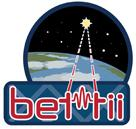

#  Thermometry Boards on Dewars for Star Detectors
This software is developed for the BETTII project by Jordi Vila at NASA Goddard Space Flight Center.

1. More information about the different board types can be found [here](https://docs.google.com/spreadsheets/d/14MjIaxqwbjARGb7AbK-nN2QmgAJrHMqJmfF0cooTO0E/edit?usp=sharing)
2. The code uses Google's protobufs in order to send data to Aurora, BETTII's ground control software

>**NOTE:** The TextFiles folder contains raw data dumped from the dewar boards that allows to test the program when not conected to the dewar and star detectors. The fReadingFile boolean has to be set to true on ThermometryReaderMain.java
